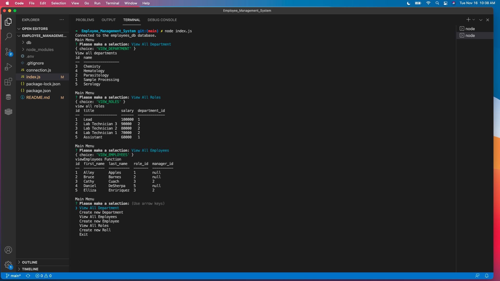

# Employee_Management_System

## Description
This application is a command-line Employee Management System using Node.js, MySQL, and Inquirer. This app takes user input to view current employees, roles, and departments, and adds new ones. 

## How it works
1. Clone this repository
2. In the terminal paste the repository  
3. Run node index.js
4. Answer the questions prompted:  
    -View all departments  
    -View all employees  
    -View all roles  
    -Create a new employee  
    -Create a new role  
    -Create a new department  
    -update an employee
    

Repository: https://github.com/MCassandra/Employee_Management_System  
Video tutorial: https://drive.google.com/file/d/1UWMkvSyYH7IEzkdsbGXq7zIkrPuf1Ca8/view?usp=sharing